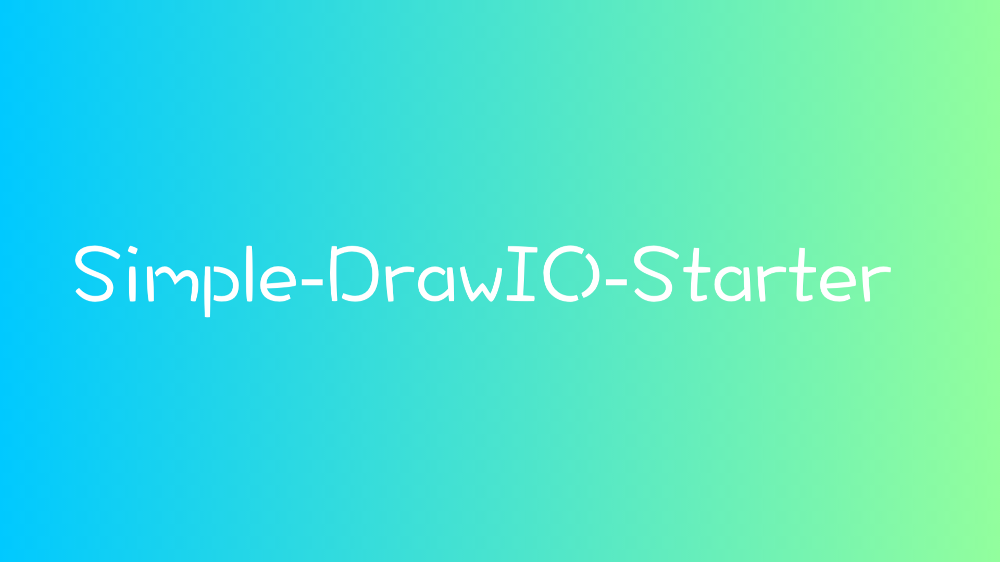

# simple-drawio-starter



[](https://next-antd-scaffold.luffyzh.now.sh/)


A simple drawio starter for pro-development.

## Develop

```bash
yarn start
```
## PROD

- 1 - build drawio

```bash
yarn build-drawio
```

- 2 - gen drawio

```bash
yarn gen-drawio
```

- 3 - build project

```bash
yarn build
```

- 4 - prod

```bash
yarn prod
```
## Deploy

 - Vercel

 - Docker

 - ...